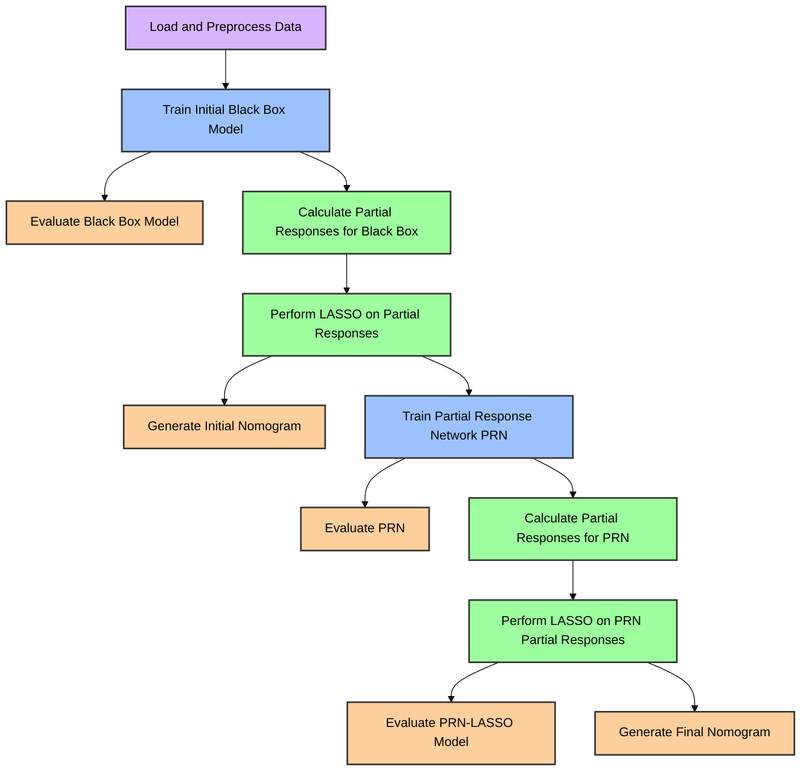

# PRiSM - Partial Responses in Structured Models

PRiSM (Partial Responses in Structured Models) is a method designed to transform **black-box classifiers into inherently interpretable models without compromising predictive performance**. This repository provides user-friendly code to implement PRiSM models, making it accessible for non-experts in machine learning.

## Getting Started

The PRiSM tool runs using `python`. To help with setup, we use `make`. Ensure you have `make` installed (exists by default on MacOS and Linux). For help with setting up `make` on Windows, see [this link](https://cookiecutter-data-science.drivendata.org/using-the-template/#installing-make-on-windows); we recommend using `chocolatey` or `scoop` for the installation.

See the [extra setup instructions](#extra-setup-instructions) if you'd like to get started with any of the following:

- without `make`, 
- using a GPU (CUDA or MPS) 
- using a specific (non-default) python interpreter on your machine.

Although you can run Jupyter notebooks directly in your browser with the python Jupyter package, we use VSCode. Regardless of your operating system, the general workflow is:

1. Download the project repository with `git clone https://github.com/AIBCTS/PRiSM.git` or by downloading a [.zip file of the repo](https://github.com/AIBCTS/PRiSM/archive/refs/heads/main.zip).
2. Install Python 3.11
3. Install Visual Studio Code
4. Set up the project's virtual environment
5. Configure VS Code for use with the project

For a full setup guide using Jupyter notebooks in VSCode, see

- [Windows Setup](SETUP_WINDOWS.md)
- [Linux Setup](SETUP_LINUX.md)
- [macOS Setup](SETUP_MACOS.md)

Once Jupyter is setup with the virtual envrionment in VScode, see [notebooks/4.00-hpi-german-cc-example.ipynb](notebooks/4.00-hpi-german-cc-example.ipynb) for an example runthrough of the PRiSM method. Alternatively, run it with Jupyter directly in your browser with `jupyter notebook /notebooks/4.00-hpi-german-cc-example.ipynb`.

Documentation for the PRiSM codebase will eventually be hosted via github pages, but for now it can be viewed locally. See [docs/README.md](docs/README.md).

### Extra setup instructions

**If you have trouble with `make`**, you can 

1. Install Python 3.11
2. Create the virtual environment in the project directory using `python -m venv venv_prism --clear --copies` and activate it (e.g. `.\venv_prism\Scripts\activate` on Windows)
3. Run `pip install -r requirements.txt` to install all packages

**If you want to use CUDA to run the project with your dedicated (NVIDIA) graphics card** on Windows (or Linux),

1. Create the virtual environment in the project directory using `python -m venv venv_prism --clear --copies` and activate it (e.g. `.\venv_prism\Scripts\activate` on Windows)
2. Ensure pip is up to date `python -m pip install --upgrade pip`
3. Install pytorch version 2.3.1 with CUDA compatability `pip install torch==2.3.1 --index-url https://download.pytorch.org/whl/cu121` You may need to choose a different CUDA version if your hardware is not CUDA 12.1 or later (e.g. CUDA 11.x), see [this link](https://pytorch.org/get-started/previous-versions/#linux-and-windows-1) for viable torch 2.3.1 install options.
4. Run `pip install -r requirements.txt` to install the remaining requirements. Since torch 2.3.1 is already installed, it should not overwrite the previously installed CUDA enabled package.
5. Verify CUDA support by running this command in the terminal:
   ```sh
   python -c "import torch; print('CUDA available:', torch.cuda.is_available(), '| CUDA version:', torch.version.cuda if torch.cuda.is_available() else 'N/A', '| GPU:', torch.cuda.get_device_name(0) if torch.cuda.is_available() else 'N/A')"
   ```
   If CUDA is available, it will return `True` for availability and show the CUDA version and GPU device name.

**If you want to use MPS to run the project with your Apple Silicon integrated memory** on macOS,

1. Ensure your macOS is up to date.
2. Create the virtual environment in the project directory using `python3.11 -m venv venv_prism --clear --copies` and activate it with `source venv_prism/bin/activate`
3. Ensure pip is up to date: `python -m pip install --upgrade pip`
4. Install PyTorch 2.4 nightly with MPS support: `pip install --pre torch --index-url https://download.pytorch.org/whl/nightly/cpu`
5. Run `pip install -r requirements.txt` to install the remaining requirements. Since PyTorch is already installed, it should not overwrite the previously installed MPS-enabled package.
6. Verify MPS support by running this command in the terminal:
   ```sh
   python -c "import torch; print('MPS available:', torch.backends.mps.is_available())"
   ```
   If it returns `True`, MPS support is successfully enabled.

**If you need to specify a specific python interpreter**, rather than that which is assigned to `python` or `python3` by default on your system, you can specify it when creating the `venv` with `make` (e.g. for an interpreter located at `/opt/python/3.11.7/bin/python3`):

```sh
make create_environment CUSTOM_PYTHON=/opt/python/3.11.7/bin/python3
```

## PRiSM Method Overview

Here is an overview of the key steps in PRiSM, as illustred in [notebooks/4.00-hpi-german-cc-example.ipynb](notebooks/4.00-hpi-german-cc-example.ipynb):



## Project Organization

```txt
├── Makefile           <- Makefile with convenience commands like `make create_environment` or `make train`
├── README.md          <- The top-level README for developers using this project
├── data               <- NB: the data directory is not included in source control.
│   ├── interim        <- Intermediate data that has been transformed
│   ├── processed      <- The final, canonical data sets for modeling
│   └── raw            <- The original, immutable data dump
│
├── docs               <- A default mkdocs project; see mkdocs.org for details
│
├── models             <- Trained and serialized models, model predictions, or model summaries
│
├── notebooks          <- Jupyter notebooks. Naming convention is a number (for ordering),
│                         the creator's initials, and a short `-` delimited description, e.g.
│                         `1.0-jqp-initial-data-exploration`.
│
├── pyproject.toml     <- Project configuration file with package metadata for prism
│                         and configuration for tools like black
│
├── requirements.txt   <- The requirements file for reproducing the analysis environment, e.g.
│                         generated with `pip freeze > requirements.txt`
│
├── setup.cfg          <- Configuration file for flake8
│
└── prism              <- Source code for use in this project
    ├── __init__.py    <- Makes prism a Python module
    ├── config.py      <- Contains definitions like DATA_DIR
    ├── device_tools.py <- Functions for managing compute devices and memory
    ├── legacy.py      <- Contains legacy functions for model evaluation
    ├── lasso.py       <- Implementation of LASSO regularization for feature selection
    ├── lasso_results.py <- Class for managing and analyzing LASSO results
    ├── maskedmlp.py   <- Masked MLP model definition and related functions
    ├── nomogram.py    <- Functions for generating nomograms from model results
    ├── partial_responses.py <- Implements partial response calculations for model interpretation
    ├── preprocessing.py <- Functions for data preprocessing
    └── save_models.py <- Helper functions for saving model parameters, models, and metrics
```

For notebook numbering guidance, see the [conventions here](https://cookiecutter-data-science.drivendata.org/using-the-template/#open-a-notebook).

To export notebooks to pdf and .py, use `nbautoexport export notebooks` from the root project directory, while the python `venv` is activated. You'll need to have [TeX installed](https://nbconvert.readthedocs.io/en/latest/install.html#installing-tex).

<p><small>Structure based on the <a target="_blank" href="https://drivendata.github.io/cookiecutter-data-science/">cookiecutter data science project template</a>.</small></p>