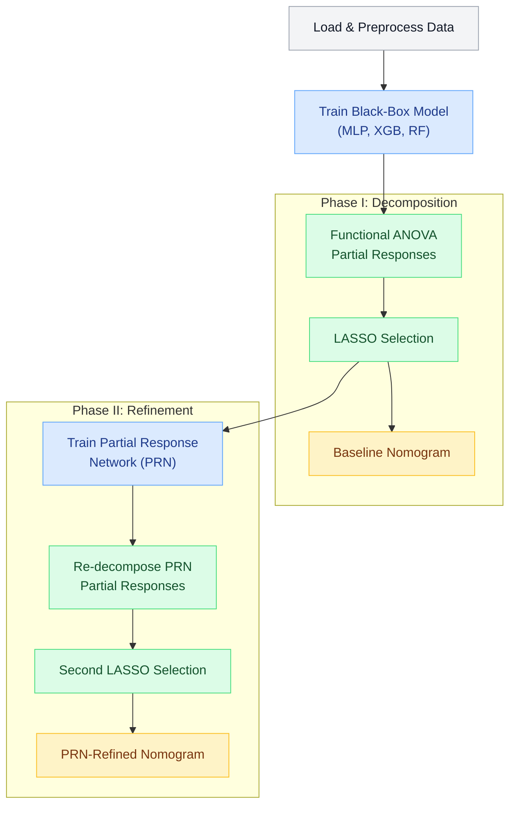

# PRiSM - Partial Responses in Structured Models

[](https://pypi.org/project/prism-xai/)
[](https://github.com/AIBCTS/PRiSM/actions/workflows/tests-quick.yml)
[](LICENSE.md)
[](https://www.python.org/downloads/)

PRiSM is a **model-agnostic framework that converts any probabilistic binary classifier for tabular data into a globally interpretable nomogram** with little compromise in predictive performance. Using functional ANOVA decomposition, it extracts main effects and pairwise interactions from black-box predictions and compiles them into an additive model that *replaces* the original classifier as the deployed predictor.

> **Repository:** [https://github.com/AIBCTS/PRiSM](https://github.com/AIBCTS/PRiSM)

---

## Installation

### From PyPI (library only)

```bash
pip install prism-xai
```

### From source (full pipeline with notebooks)

```bash
git clone https://github.com/AIBCTS/PRiSM.git
cd PRiSM
pip install -e ".[notebooks]"
```

### Quick usage

```python
import prism
from prism.data import load_example_dataset

# Load a bundled example dataset
df = load_example_dataset('htx_example')
print(df.shape)
```

> **Note:** The CLI commands (`prism run`, `prism tune`, etc.) require a cloned repository with notebooks. pip-only installs provide the `prism` library and bundled example datasets.

---

## Quick Start (from cloned repository)

The fastest way to explore PRiSM using the included heart transplant example dataset:

```bash
# 1. Clone and navigate to project
git clone https://github.com/AIBCTS/PRiSM.git
cd PRiSM

# 2. Create virtual environment (Python >=3.11 required)
python -m venv venv_prism
# Windows: .\venv_prism\Scripts\activate
# Linux/Mac: source venv_prism/bin/activate

# 3. Install dependencies
pip install -e ".[notebooks]"

# 4. Configure dataset (htx_example is pre-configured)
cp .env.example .env

# 5. Open in VSCode/JupyterLab and run notebooks in order (select venv_prism as Jupyter kernel):
#    preprocessing.ipynb -> modelling/train_mlp.ipynb -> prism_analysis.ipynb
```

> **Important:** If you change `.env`, restart your Jupyter kernel for changes to take effect.

---

## Project Overview: Three Layers

PRiSM offers three levels of usage, from simple exploration to production pipelines:

| Layer                     | Use Case                           | Entry Point                                          |
| ------------------------- | ---------------------------------- | ---------------------------------------------------- |
| **Quick Start**           | First exploration, learning PRiSM  | Jupyter notebooks with htx_example                   |
| **Interactive Notebooks** | Custom datasets, experimentation   | Configure `.env`, run notebooks manually             |
| **Pipeline Runners**      | Batch experiments, reproducibility | `prism run` CLI (or legacy `run_prism_pipeline.py`)  |

---

## Environment Setup

### Option A: Virtual Environment (Recommended)

Works on all platforms (Windows, Linux, macOS). Best for most users.

```bash
# Using make (recommended)
make create_environment
# Windows: .\venv_prism\Scripts\activate
# Linux/Mac: source venv_prism/bin/activate

# Or manually
python -m venv venv_prism --clear --copies
# Activate as above
pip install -r requirements.txt
```

**GPU Support (Optional):**

- **NVIDIA CUDA:** Install PyTorch with CUDA before requirements (specify your CUDA version in the URL, e.g. `cu126` for CUDA 12.6):
  ```bash
  pip3 install torch --index-url https://download.pytorch.org/whl/cu126 --force-reinstall
  pip install -r requirements.txt
  ```
  Verify: `python -c "import torch; print('CUDA:', torch.cuda.is_available())"`

- **GPU-Optimized Inference:** For faster XGBoost/RF partial response calculations:
  ```bash
  # CUDA 12.x (most local installs):
  make requirements-gpu
  # Or: pip install -e ".[gpu]"

  # CUDA 13.x (NGC containers, e.g. DGX Spark/DGX2):
  pip install -e ".[gpu-cuda13x]"
  ```
  This installs cupy for zero-copy GPU tensor operations (speedup on large batches).

- **Apple Silicon (MPS):** Works automatically with standard setup.
  Verify: `python -c "import torch; print('MPS:', torch.backends.mps.is_available())"`

### Option B: Docker (NVIDIA GPU Systems)

Docker provides isolated, reproducible environments. **Requires NVIDIA GPU and drivers.**

| User Type                     | Recommended Setup                                                |
| ----------------------------- | ---------------------------------------------------------------- |
| Quick start (any system)      | Virtual environment                                              |
| Mac (Apple Silicon)           | Virtual environment only (MPS not accessible in Docker)          |
| Windows (with or without GPU) | Virtual environment (venv with CUDA is simpler than Docker+WSL2) |
| Linux with NVIDIA GPU         | Docker recommended                                               |
| DGX/Multi-GPU systems         | Docker recommended                                               |

```bash
# Quick start with GPU
bash docker-run.sh

# Or using docker compose
docker compose run --rm prism
```

For CPU-only Docker usage:
```bash
docker compose -f docker-compose.yml -f docker-compose.cpu.yml run --rm prism
```

See [README_DOCKER.md](docs/README_DOCKER.md) for complete Docker documentation.

### Platform-Specific Setup Guides

Detailed setup instructions for each platform:

- [Windows Setup](docs/SETUP_WINDOWS.md)
- [Linux Setup](docs/SETUP_LINUX.md)
- [macOS Setup](docs/SETUP_MACOS.md)

---

## Using the Notebooks

### Configuration

Create a `.env` file in the project root:

```bash
cp .env.example .env
```

Two configuration modes are available:

```bash
# Option A: Full config (loads example_notebooks/config/{name}.yaml)
PRISM_CONFIG=htx_example

# Option B: Quick mode (uses CSV in data/raw/ with defaults)
PRISM_DATASET=my_data
```

> **Important:** Restart your Jupyter kernel after changing `.env` for changes to take effect.

### Notebook Pipeline

Run notebooks in `example_notebooks/` in this order:

1. **Preprocessing** (`preprocessing.ipynb`)
   - Loads raw data, handles missing values, encodes categoricals
   - Splits into train/test/validation sets
   - Outputs to `data/interim/` and `data/processed/`

   > **Note on terminology:** PRiSM uses "test" for hyperparameter tuning and "validation" for final model evaluation. This differs from some conventions where "validation" is used for tuning. The split order is: train (60%) / test (20%) / validation (20%).

2. **Model Training** (`modelling/` subdirectory)
   - `train_mlp.ipynb` - Multilayer Perceptron
   - `train_xgb.ipynb` - XGBoost
   - `train_rf.ipynb` - Random Forest
   - `train_logreg.ipynb` - Logistic Regression
   - `train_impact.ipynb` - Pre-trained clinical model (heart transplant data)

3. **PRiSM Analysis** (`prism_analysis.ipynb`)
   - **Phase I -- Black-box decomposition:** functional ANOVA decomposes predictions into univariate main effects and bivariate interactions (partial responses); LASSO selects important terms and assembles a baseline nomogram
   - **Phase II -- PRN refinement:** trains a Partial Response Network (structured MLP constrained to selected effects), re-decomposes its predictions, and applies a second LASSO pass to produce the final PRN-refined nomogram

### Using Your Own Data

1. Place your CSV file in `data/raw/` (e.g., `data/raw/my_data.csv`)
2. Create a config file `example_notebooks/config/my_data.yaml`:
   ```yaml
   dataset: my_data
   models: [mlp]
   target_candidates: ['your_target_column']
   splitting_method: 'random'
   split_ratios: [0.6, 0.2, 0.2]
   ```
3. Set `PRISM_CONFIG=my_data` in `.env`
4. Run the notebook pipeline

See `example_notebooks/config/example_config.yaml` for all available options.

> **OpenML datasets:** You can also use datasets from [OpenML](https://www.openml.org/) directly by setting `dataset: openml_<id>` in your config (e.g., `openml_31` for credit-g). The dataset will be fetched automatically via the OpenML API.

### Example Datasets

- **htx_example**: Synthetic heart transplant data preserving statistical properties of UNOS registry data (1997-2022). No patient data is replicated.

---

## Automated Pipeline Runners

For batch experiments and reproducible research, use the command-line pipeline runners.
Both the `prism` CLI and the legacy `python run_*.py` scripts are supported:

| CLI (after `pip install`)        | Script (from repo root)                           |
| -------------------------------- | ------------------------------------------------- |
| `prism run htx_example`          | `python run_prism_pipeline.py htx_example`        |
| `prism run-parallel htx_example` | `python run_prism_parallel.py htx_example`        |
| `prism tune htx_example`         | `python run_hyperparameter_tuning.py htx_example` |
| `prism list-configs`             | `python run_prism_pipeline.py --list-configs`     |

See the [Pipeline Usage Guide](docs/PIPELINE_USAGE.md) for multi-GPU execution, PRiSM-only mode, batch runs, caching, output structure, and other advanced workflows.

```bash
prism run htx_example                       # Run full pipeline
prism run htx_example my_config             # Multiple configs
prism run htx_example --skip-preprocessing  # Use existing preprocessed data
prism list-configs                          # List available configs
```

Results are saved to `example_notebooks/pipeline_results/{date}_{config}/`.

---

## Configuration Reference

### YAML Config Files

Config files in `example_notebooks/config/` control all aspects of the pipeline:

```yaml
# Required
dataset: my_dataset          # Maps to data/raw/{dataset}.csv
models: [mlp, xgb]          # Models to train

# Preprocessing
random_seed: 257
splitting_method: 'random'   # 'random', 'temporal', or 'predefined'
split_ratios: [0.6, 0.2, 0.2]
target_candidates: ['outcome', 'target']
id_candidates: ['id', 'patient_id']

# Categorical encoding
integer_encoding:
  education: ['Elementary', 'High School', 'Bachelor', 'Master', 'PhD']

# PRiSM analysis
partial_response_method: 'lebesgue'  # or 'dirac'
save_nomogram_json: true

# LASSO lambda selection
lasso_lambda_selection:
  blackbox:
    method: 'max_test_auc'
    target_ratio: 0.998
  prn:
    method: 'max_test_auc'
    target_ratio: 0.998

# Hyperparameter tuning (Optuna)
hyperparameter_tuning:
  mlp:
    enabled: true
    n_trials: 25
  prn:
    enabled: true
    n_trials: 15
```

See `example_notebooks/config/example_config.yaml` for complete documentation of all options.

### Environment Variables

Optional directory overrides in `.env`:
```bash
PRISM_MODELS_DIR=           # Custom models directory
PRISM_INTERIM_DATA_DIR=     # Custom interim data directory
PRISM_PROCESSED_DATA_DIR=   # Custom processed data directory
```

---

## PRiSM Method Overview



---

## Project Organization

```txt
PRiSM/
|-- Makefile                <- Convenience commands (make create_environment, etc.)
|-- README.md               <- This file
|-- run_prism_pipeline.py   <- Pipeline runner (backward-compat stub -> prism.cli)
|-- run_prism_parallel.py   <- Multi-GPU parallel runner (stub)
|-- run_hyperparameter_tuning.py <- Hyperparameter tuning (stub)
|
|-- data/                   <- Data directory (not in source control)
|   |-- raw/                <- Original data files
|   |-- interim/            <- Intermediate transformed data
|   +-- processed/          <- Final datasets for modeling
|
|-- models/                 <- Trained models, predictions, results
|
|-- example_notebooks/      <- Jupyter notebooks
|   |-- preprocessing.ipynb <- Data preprocessing
|   |-- prism_analysis.ipynb <- PRiSM analysis
|   |-- config/             <- YAML configuration files
|   +-- modelling/          <- Model training notebooks
|
|-- prism/                  <- Source code package
|   |-- config.py           <- Dataset configuration and paths
|   |-- preprocessing.py    <- Data preprocessing functions
|   |-- device_tools.py     <- GPU/CPU device management
|   |-- maskedmlp.py        <- Masked MLP model
|   |-- cli/                <- CLI entry points (prism run, tune, etc.)
|   |-- data/               <- Bundled example datasets (htx_example)
|   |-- lasso/              <- LASSO feature selection
|   |-- partial_responses/  <- Partial response calculation
|   +-- plotting/           <- Visualization pipeline
|
|-- requirements.txt        <- Python dependencies (editable install)
+-- pyproject.toml          <- Package metadata and dependency spec
```

---

## Development

Install development dependencies:

```bash
make create_environment_dev
# Or: pip install -e ".[dev,test]"
```

Run tests:
```bash
make test              # Run all tests
make test-coverage     # With coverage report
```

Format and lint:
```bash
make format            # Format with black
make lint              # Run flake8, isort, black checks
```

Export notebooks to PDF/Python:
```bash
nbautoexport export example_notebooks
```
Requires TeX and Pandoc. See [LATEX_TROUBLESHOOTING.md](docs/LATEX_TROUBLESHOOTING.md) for help.

---

## Data Availability

**UNOS Data**: Available from SRTR (https://www.srtr.org/requesting-srtr-data/data-requests/) under authorized license.

**Example Data**: The synthetic `htx_example` dataset is included for immediate testing.
